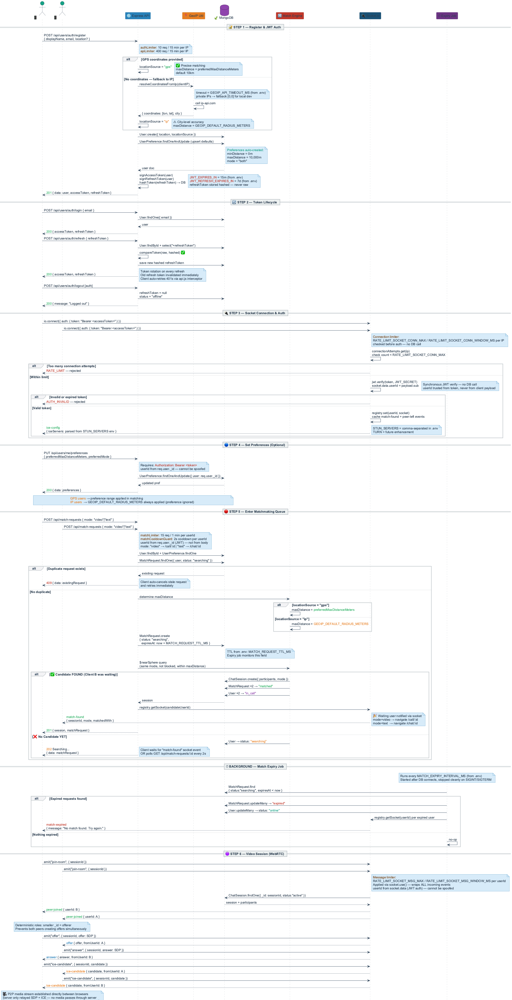
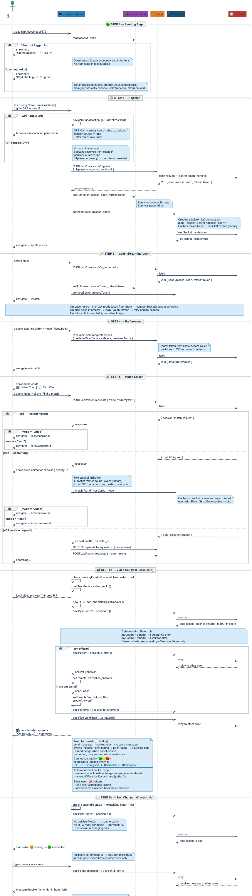

<div align="center">

# 🌍 Chattrix

### Proximity-based random video & text chat platform

[](https://nodejs.org)
[](https://mongodb.com)
[](https://react.dev)
[](https://socket.io)
[](https://webrtc.org)
[](https://jwt.io)

**Connect instantly with strangers nearby. No algorithms. No feeds. Just real conversations.**

[Features](#-features) • [Setup](#-first-time-setup) • [Schemas](#-schema-reference) • [API](#-api-reference) • [Socket Events](#-socket-events) • [Diagrams](#-architecture-diagrams)

</div>

---

> ⚠️ **For any AI agent or developer making changes** — read the [Schema Reference](#-schema-reference) and [Frontend State Reference](#-frontend-state-reference) sections before modifying any code. All field names, enums, and contracts are defined there.

---

## 📁 Project Structure

```
Chattrix/
├── apps/
│   ├── server/          ← Express + Socket.io + MongoDB  (port 3000)
│   └── client/          ← React + Vite                   (port 5173)
├── docs/
│   ├── lld_backend.uml / .png
│   └── lld_frontend.uml / .png
├── package.json         ← root scripts (concurrently)
└── README.md
```

---

## ✨ Features

| Feature | Description |
|---------|-------------|
| 📹 **Video Chat** | WebRTC P2P video with live text chat panel |
| 💬 **Text Chat** | Anonymous text-only chat, no camera needed |
| 📍 **Proximity Matching** | GPS or IP-based location — match nearby strangers |
| ⚡ **Instant Matching** | Matched in seconds, skip anytime for next match |
| 🔐 **JWT Auth** | Access + refresh token rotation, auto-refresh on expiry |
| 🛡 **Rate Limiting** | Per-IP and per-user limits on all sensitive routes |
| 🔄 **Auto-search** | Skip → instantly searches for next match |
| 👤 **Profile** | Edit displayName, avatar, languages after register |
| 🚫 **Block User** | Block strangers from future matches |
| ••• **Typing Indicator** | See when your chat partner is typing |
| 🟢 **Connection Quality** | Live RTT-based signal strength indicator |
| 🔄 **Auto-reconnect** | WebRTC ICE restart on call drop |

---

## 🚀 First Time Setup

<details>
<summary><strong>1. Prerequisites</strong></summary>

- Node.js v18+
- npm v9+
- Homebrew (macOS)

</details>

<details>
<summary><strong>2. Install MongoDB</strong></summary>

```bash
brew tap mongodb/brew
brew install mongodb-community
brew services start mongodb/brew/mongodb-community
```

Verify:

```bash
mongosh --eval "db.runCommand({ ping: 1 })" --quiet
# expected: { ok: 1 }
```

</details>

<details>
<summary><strong>3. Install Dependencies</strong></summary>

```bash
cd Chattrix
npm install

cd apps/server && npm install
cd ../client  && npm install
```

</details>

<details>
<summary><strong>4. Environment Variables</strong></summary>

```bash
cp apps/server/.env.example apps/server/.env
cp apps/client/.env.example apps/client/.env
```

**Server `.env` keys:**

| Key | Default | Description |
|-----|---------|-------------|
| `PORT` | `3000` | Server port |
| `MONGODB_URI` | `mongodb://127.0.0.1:27017/chattrix` | MongoDB connection |
| `CLIENT_ORIGIN` | `http://localhost:5173` | CORS allowed origin |
| `JWT_SECRET` | — | ⚠️ Change in production |
| `JWT_EXPIRES_IN` | `15m` | Access token TTL |
| `JWT_REFRESH_SECRET` | — | ⚠️ Change in production |
| `JWT_REFRESH_EXPIRES_IN` | `7d` | Refresh token TTL |
| `RATE_LIMIT_API_MAX` | `400` | API requests / 15 min / IP |
| `RATE_LIMIT_AUTH_MAX` | `10` | Auth requests / 15 min / IP |
| `RATE_LIMIT_MATCH_MAX` | `15` | Match requests / 1 min / userId |
| `RATE_LIMIT_MATCH_COOLDOWN_MS` | `2000` | Cooldown between match requests |
| `RATE_LIMIT_SOCKET_CONN_MAX` | `5` | Socket connections / 1 min / IP |
| `RATE_LIMIT_SOCKET_MSG_MAX` | `10` | Socket messages / 1 sec / userId |
| `GEOIP_DEFAULT_RADIUS_METERS` | `20000` | Match radius for IP users |
| `MATCH_REQUEST_TTL_MS` | `120000` | Match request expiry (2 min) |
| `MATCH_EXPIRY_INTERVAL_MS` | `30000` | Expiry job interval (30 sec) |
| `STUN_SERVERS` | `stun:stun.l.google.com:19302,...` | Comma-separated STUN URLs |
| `TURN_SERVERS` | — | Comma-separated TURN URLs (recommended for NAT traversal) |
| `TURN_USERNAME` | — | TURN auth username |
| `TURN_CREDENTIAL` | — | TURN auth credential/password |
| `RECORDING_PROVIDER` | `idrive_e2` | Recording storage provider label |
| `RECORDING_S3_BUCKET` | — | S3 bucket name for call recordings |
| `RECORDING_S3_REGION` | — | S3 region |
| `RECORDING_S3_ACCESS_KEY_ID` | — | S3 access key |
| `RECORDING_S3_SECRET_ACCESS_KEY` | — | S3 secret key |
| `RECORDING_S3_ENDPOINT` | — | Optional S3-compatible endpoint (IDrive E2/R2/MinIO) |
| `RECORDING_S3_FORCE_PATH_STYLE` | `true` | Set `true` for path-style S3 providers |
| `RECORDING_PUBLIC_BASE_URL` | — | Optional public base URL for stored objects |
| `RECORDING_UPLOAD_EXPIRES_SECONDS` | `900` | Presigned upload URL expiry |

**Client `.env` keys:**

| Key | Default | Description |
|-----|---------|-------------|
| `VITE_API_URL` | `http://localhost:3000` | Backend REST URL |
| `VITE_SOCKET_URL` | `http://localhost:3000` | Backend Socket.io URL |

</details>

---

## ▶️ Running the App

```bash
# Both together (recommended)
cd Chattrix
npm run dev
```

```bash
# Separately
cd apps/server && npm run dev   # Terminal 1 — backend
cd apps/client && npm run dev   # Terminal 2 — frontend
```

| Service  | URL |
|----------|-----|
| 🖥 Frontend | http://localhost:5173 |
| 🌐 Backend  | http://localhost:3000 |
| 💚 Health   | http://localhost:3000/health |

---

## 🗺 User Flow

```
Register / Login
  ↓
Set Preferences (distance, mode)
  ↓
Match Screen — pick 📹 Video or 💬 Text
  ↓
Matched instantly or wait (socket push)
  ↓
Video Call (/call/:id)     Text Chat (/chat/:id)
  WebRTC P2P                 Socket relay only
  + text chat panel          no camera needed
  ↓                          ↓
Skip → auto-search next    End → /ended screen
```

---

## 🗄 Schema Reference

> ⚠️ Read this before modifying any model, controller, or frontend form field.

<details>
<summary><strong>User</strong></summary>

| Field | Type | Required | Notes |
|-------|------|----------|-------|
| `_id` | ObjectId | auto | |
| `username` | String | ✅ | 3–20 chars, unique, lowercase, `[a-z0-9_]` only |
| `displayName` | String | ✅ | 2–50 chars, set to username on register |
| `avatarUrl` | String | ❌ | default `null` |
| `languages` | [String] | ❌ | default `[]` |
| `location` | GeoPoint | ✅ | `{ type: "Point", coordinates: [lon, lat] }` |
| `locationSource` | String | ❌ | enum: `"gps"` \| `"ip"` — default `"ip"` |
| `locationUpdatedAt` | Date | ❌ | |
| `status` | String | ❌ | enum: `"offline"` \| `"online"` \| `"searching"` \| `"in_call"` |
| `isDiscoverable` | Boolean | ❌ | default `true` |
| `blockedUsers` | [ObjectId] | ❌ | ref: User, session-scoped |
| `expiresAt` | Date | ❌ | default `now + SESSION_TTL_MS` — MongoDB TTL auto-deletes |
| `createdAt` | Date | auto | |
| `updatedAt` | Date | auto | |

**Indexes:** `location` (2dsphere), `status + isDiscoverable`, `username`, `expiresAt` (TTL)

> `refreshToken` and `email` removed. Auth is username-only with 15-min session TTL.

</details>

<details>
<summary><strong>UserPreference</strong></summary>

| Field | Type | Required | Notes |
|-------|------|----------|-------|
| `_id` | ObjectId | auto | |
| `user` | ObjectId | ✅ | ref: User, unique |
| `preferredMinDistanceMeters` | Number | ❌ | min 0, default `0` |
| `preferredMaxDistanceMeters` | Number | ❌ | min 100, default `10000` |
| `preferredMode` | String | ❌ | enum: `"audio"` \| `"video"` \| `"both"` — default `"both"` |
| `languageCodes` | [String] | ❌ | default `[]` |
| `allowLocalMatching` | Boolean | ❌ | default `true` |
| `createdAt` | Date | auto | |
| `updatedAt` | Date | auto | |

> Auto-created (upsert) on user registration. Validation: `min <= max` distance.

</details>

<details>
<summary><strong>MatchRequest</strong></summary>

| Field | Type | Required | Notes |
|-------|------|----------|-------|
| `_id` | ObjectId | auto | |
| `user` | ObjectId | ✅ | ref: User |
| `mode` | String | ✅ | enum: `"video"` \| `"text"` ← **audio removed** |
| `minDistanceMeters` | Number | ❌ | min 0, default `0` |
| `maxDistanceMeters` | Number | ✅ | min 100 |
| `locationSnapshot` | GeoPoint | ✅ | snapshot at request time |
| `status` | String | ❌ | enum: `"searching"` \| `"matched"` \| `"cancelled"` \| `"expired"` |
| `requestedAt` | Date | ❌ | default `now` |
| `matchedAt` | Date | ❌ | default `null` |
| `expiresAt` | Date | ❌ | default `now + MATCH_REQUEST_TTL_MS` |
| `createdAt` | Date | auto | |

**Indexes:** `locationSnapshot` (2dsphere), `status+mode+requestedAt`
**Unique partial:** `user+status` where `status="searching"` — one active search per user

</details>

<details>
<summary><strong>ChatSession</strong></summary>

| Field | Type | Required | Notes |
|-------|------|----------|-------|
| `_id` | ObjectId | auto | |
| `participants` | [ObjectId] | ✅ | ref: User, exactly 2 |
| `mode` | String | ✅ | enum: `"video"` \| `"text"` ← **audio removed** |
| `initiatedBy` | ObjectId | ✅ | ref: User |
| `matchRequests` | [ObjectId] | ❌ | ref: MatchRequest |
| `recordings` | [ObjectId] | ❌ | ref: CallRecording |
| `distanceMeters` | Number | ❌ | default `null` |
| `status` | String | ❌ | enum: `"active"` \| `"ended"` \| `"failed"` |
| `startedAt` | Date | ❌ | default `now` |
| `endedAt` | Date | ❌ | default `null` |
| `endedBy` | ObjectId | ❌ | ref: User, default `null` |
| `endReason` | String | ❌ | enum: `"completed"` \| `"skipped"` \| `"disconnect"` \| `"timeout"` \| `"error"` |
| `createdAt` | Date | auto | |

**Index:** `status + startedAt`

</details>

<details>
<summary><strong>CallRecording</strong></summary>

| Field | Type | Required | Notes |
|-------|------|----------|-------|
| `_id` | ObjectId | auto | |
| `chatSession` | ObjectId | ✅ | ref: ChatSession |
| `ownerUser` | ObjectId | ✅ | ref: User |
| `participantUsers` | [ObjectId] | ✅ | ref: User |
| `provider` | String | ✅ | enum: `"aws_s3"` \| `"idrive_e2"` \| `"gcp_storage"` \| `"azure_blob"` \| `"cloudflare_r2"` \| `"other"` |
| `bucketName` | String | ✅ | |
| `objectKey` | String | ✅ | |
| `fileUrl` | String | ✅ | |
| `region` | String | ❌ | default `null` |
| `mimeType` | String | ❌ | default `"video/webm"` |
| `sizeBytes` | Number | ❌ | default `0` |
| `durationSeconds` | Number | ❌ | default `0` |
| `startedAt` | Date | ❌ | default `null` |
| `endedAt` | Date | ❌ | default `null` |
| `status` | String | ❌ | enum: `"uploading"` \| `"available"` \| `"failed"` \| `"deleted"` |
| `uploadError` | String | ❌ | default `null` |
| `metadata` | Map\<String,String\> | ❌ | default `{}` |
| `expiresAt` | Date | ❌ | default `null` |
| `createdAt` | Date | auto | |

**Unique:** `provider + bucketName + objectKey`

</details>

---

## 🖥 Frontend State Reference

> ⚠️ Read this before modifying any page, store, or socket event handler.

<details>
<summary><strong>Zustand Auth Store</strong> — <code>apps/client/src/store/auth.store.js</code></summary>

| Key | Type | Description |
|-----|------|-------------|
| `user` | `User \| null` | Full user object from backend |
| `accessToken` | `string \| null` | JWT, expires in 15m |

**Actions:** `setAuth(user, accessToken)` · `clearAuth()`

**Persistence:** localStorage key `"chattrix-auth"`

**On page load:** `main.jsx` checks JWT expiry → if expired `clearAuth()` → else `connectSocket(accessToken)`

</details>

<details>
<summary><strong>API Client</strong> — <code>apps/client/src/lib/api.js</code></summary>

- Base URL: `VITE_API_URL` (from `.env`)
- All requests: `Authorization: Bearer <accessToken>`
- **Auto-refresh on 401:** → `POST /api/users/auth/refresh` → update store → retry original request → if refresh fails → `clearAuth()` → redirect `/login`
- **409 handling:** throws `err` with `err.status=409`, `err.data=existing resource` → caller uses `err.data._id` to cancel stale request

</details>

<details>
<summary><strong>Socket Client</strong> — <code>apps/client/src/lib/socket.js</code></summary>

| Method | Description |
|--------|-------------|
| `connectSocket(token)` | Creates singleton if not exists, returns existing if alive |
| `disconnectSocket()` | Disconnect + null + clear pending events |
| `getSocket()` | Returns current socket or null |
| `getPendingMatch()` / `clearPendingMatch()` | Cached `match-found` event |
| `getPendingPeerLeft()` / `clearPendingPeerLeft()` | Cached `peer-left` event |

> Cached events survive React StrictMode double-invoke. Socket auth: `io({ auth: { token: "Bearer <accessToken>" } })`

</details>

<details>
<summary><strong>Routes & Guards</strong></summary>

| Route | Page | Access | Notes |
|-------|------|--------|-------|
| `/` | Landing | Public | Username entry screen |
| `/preferences` | Preferences | 🔒 Guard | Distance slider + mode |
| `/match` | Match | 🔒 Guard | Mode cards + find match |
| `/call/:sessionId` | Call | 🔒 Guard | WebRTC video session |
| `/chat/:sessionId` | Chat | 🔒 Guard | Text-only session |
| `/ended` | Ended | 🔒 Guard | Session ended screen |

> **Guard:** no `accessToken` or expired token → redirect `/`

> **Guard:** no `accessToken` → redirect `/login`

</details>

<details>
<summary><strong>Navigation Rules</strong></summary>

| Action | Navigates to |
|--------|-------------|
| Skip ⏭ (video) | `/match?autostart=video` |
| Skip ⏭ (text) | `/match?autostart=text` |
| End 📵 | `/ended` |
| `peer-left` received | `/match?autostart=video\|text` |
| `match-found` with `mode=video` | `/call/:sessionId` |
| `match-found` with `mode=text` | `/chat/:sessionId` |
| `?autostart` param on Match | auto-triggers `doSearch(mode)` after 300ms |

</details>

---

## 🔌 Socket Events

<details>
<summary><strong>Client → Server</strong></summary>

| Event | Payload | Description |
|-------|---------|-------------|
| `join-room` | `{ sessionId }` | Join session room after match |
| `leave-room` | — | Skip / end session |
| `offer` | `{ sessionId, offer }` | Relay WebRTC SDP offer |
| `answer` | `{ sessionId, answer }` | Relay WebRTC SDP answer |
| `ice-candidate` | `{ sessionId, candidate }` | Relay ICE candidate |
| `send-message` | `{ sessionId, text }` | Send text message |
| `typing` | `{ sessionId, isTyping }` | Typing indicator |

</details>

<details>
<summary><strong>Server → Client</strong></summary>

| Event | Payload | Description |
|-------|---------|-------------|
| `ice-config` | `{ iceServers }` | STUN config on connect |
| `match-found` | `{ sessionId, mode }` | Match ready — navigate to session |
| `match-expired` | `{ message }` | No match found — retry |
| `peer-joined` | `{ userId }` | Other peer entered room |
| `peer-left` | `{ userId, endReason }` | Other peer disconnected |
| `receive-message` | `{ text, fromUserId, timestamp }` | Incoming text message |
| `peer-typing` | `{ isTyping }` | Peer typing indicator |
| `error` | `{ message }` | Rate limit or socket error |

</details>

---

## 📡 API Reference

<details>
<summary><strong>Auth</strong> — public, authLimiter: 10 req / 15 min / IP</summary>

| Method | Endpoint | Body | Response |
|--------|----------|------|----------|
| `GET` | `/api/users/check/:username` | — | `{ available: bool, suggestions? }` |
| `POST` | `/api/users/auth/register` | `{ username, location? }` | `201 { data: user, accessToken }` |

</details>

<details>
<summary><strong>Users</strong> — protected (Bearer token required)</summary>

| Method | Endpoint | Body | Response |
|--------|----------|------|----------|
| `GET` | `/api/users/me` | — | own profile |
| `PATCH` | `/api/users/me` | `{ displayName?, avatarUrl?, languages? }` | updated user |
| `PATCH` | `/api/users/me/location` | `{ coordinates? }` | updated user |
| `PATCH` | `/api/users/me/status` | `{ status }` | updated user |
| `DELETE` | `/api/users/me` | — | deletes user + preferences |
| `GET` | `/api/users/me/preferences` | — | preferences |
| `PUT` | `/api/users/me/preferences` | `{ preferredMode, preferredMaxDistanceMeters, ... }` | updated preferences |
| `GET` | `/api/users/me/sessions` | — | session history |
| `GET` | `/api/users/:userId` | — | public profile |
| `POST` | `/api/users/block/:userId` | — | block user |
| `DELETE` | `/api/users/block/:userId` | — | unblock user |

</details>

<details>
<summary><strong>Matching</strong> — protected, matchLimiter: 15 req / min / userId + 2s cooldown</summary>

| Method | Endpoint | Body | Response |
|--------|----------|------|----------|
| `POST` | `/api/match-requests` | `{ mode: "video"\|"text" }` | `201 matched` / `202 searching` / `409 duplicate` |
| `GET` | `/api/match-requests/:id` | — | match request status |
| `DELETE` | `/api/match-requests/:id` | — | cancelled |

</details>

<details>
<summary><strong>Sessions</strong> — protected</summary>

| Method | Endpoint | Body | Response |
|--------|----------|------|----------|
| `GET` | `/api/sessions/:id` | — | session details |
| `PATCH` | `/api/sessions/:id/end` | `{ endReason }` | ended session |

</details>

<details>
<summary><strong>Recordings</strong> — protected</summary>

| Method | Endpoint | Body | Response |
|--------|----------|------|----------|
| `POST` | `/api/recordings/presign` | `{ chatSessionId, mimeType?, extension? }` | presigned upload URL |
| `POST` | `/api/recordings/finalize` | `{ chatSessionId, provider, bucketName, objectKey, fileUrl, ... }` | `201 recording` |
| `POST` | `/api/recordings` | `{ chatSessionId, ownerUserId, provider, bucketName, objectKey, fileUrl, ... }` | `201 recording` |
| `GET` | `/api/recordings/:id` | — | single recording |
| `GET` | `/api/recordings/user/:userId` | — | recordings by user |
| `GET` | `/api/recordings/session/:id` | — | recordings by session |
| `DELETE` | `/api/recordings/:id` | — | soft delete (status → deleted) |

</details>

---

## 🏗 Architecture Diagrams

### Backend LLD



### Frontend LLD



---

## 📝 Docs

- [`docs/lld_backend.uml`](docs/lld_backend.uml) — Backend flow (auth, matching, socket, jobs)
- [`docs/lld_frontend.uml`](docs/lld_frontend.uml) — Frontend flow (pages, state, WebRTC, chat)

To regenerate diagrams after UML changes:

```bash
plantuml docs/lld_backend.uml
plantuml docs/lld_frontend.uml
```
